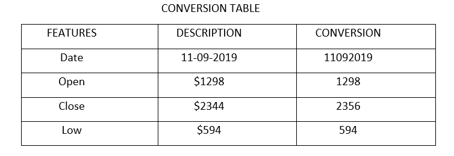
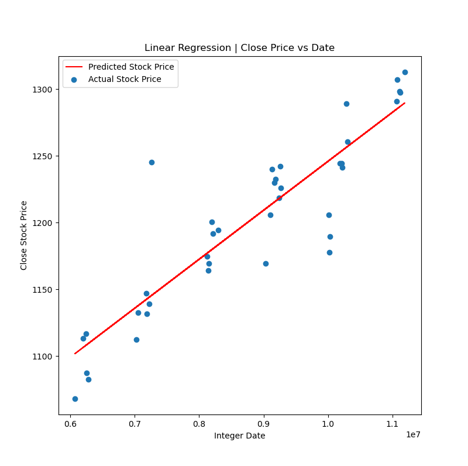
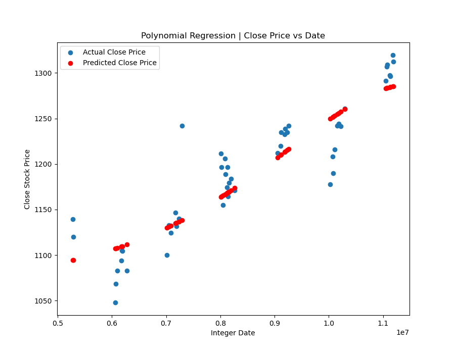

%# Stock-Market-Prediction
Performed Stock Market Prediction on GOOGL Alphabet INC. Class A Common Stock Dataset from National Association of Securities Dealers Automated Quotations (NASDAQ) website.
Stocks from June 2019 to November 2019 were utilized.
Dates, Lowest value of stock, Close and Open stock prices were converted to integers.

After calculating correlation of features, Dates were selected as a feature for predicting the Close Price date.
RESULTS:
Linear Regression:
Accuracy: 78.7895%

Polynomial Regression:
Accuracy: 80.79%

Support Vector Regression:
Accuracy: 88.06385%

Random Forests:
Accuracy: 93.88%

